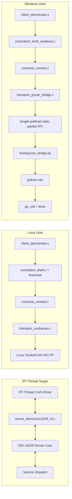

[中文](README_ZN.md)

# RT-Thread UDS Server and Client Demo

Reference project for **RT-Thread UDS server integration** and **host-side UDS client execution**.

This repository is organized around one goal: keep the **UDS / ISO-TP business logic in C**, keep the **RT-Thread server integration isolated in `server_demo/`**, and let each host platform use the transport path that best matches its native environment.

## Documentation map

- [Chinese README](README_ZN.md)
- [Architecture Overview](docs/architecture.md)
- [API Reference](docs/api-reference.md)
- [Linux Build and Run Guide](docs/linux-build.md)
- [Windows Build Guide](docs/windows-build.md)
- [Python / pip Workflow for `PYCAN_BRIDGE`](docs/pycan-pip-workflow.md)
- [Server Module Notes](server_demo/README.md)

## Repository layout

```text
.
├── README.md
├── README_ZN.md
├── docs/
│   ├── architecture.md
│   ├── architecture.zh-CN.md
│   ├── api-reference.md
│   ├── api-reference.zh-CN.md
│   ├── linux-build.md
│   ├── linux-build.zh-CN.md
│   ├── windows-build.md
│   ├── windows-build.zh-CN.md
│   ├── pycan-pip-workflow.md
│   └── pycan-pip-workflow.zh-CN.md
├── iso14229.c
├── iso14229.h
├── client_demo/
│   ├── CMakeLists.txt
│   ├── CMakePresets.json
│   ├── Makefile
│   ├── main.c
│   ├── core/
│   ├── platform/
│   ├── services/
│   ├── tools/
│   ├── transport/
│   └── utils/
└── server_demo/                  # Git submodule: RT-Thread server-side tree
    ├── Kconfig
    ├── SConscript
    ├── iso14229_rtt.c
    ├── iso14229_rtt.h
    ├── rtt_uds_config.h
    ├── README.md
    └── README_ZN.md
```

## Submodule note for `server_demo/`

`server_demo/` is treated as an independently maintained Git submodule. In this repository, the directory should be **used and documented**, but its contents should not be rewritten from the superproject side.

Clone with the submodule populated from the start:

```bash
git clone --recurse-submodules <repo-url>
```

If the superproject is already cloned, initialize and update the submodule with:

```bash
git submodule update --init --recursive
```

If the submodule URL or branch mapping changes upstream, resync before updating:

```bash
git submodule sync --recursive
git submodule update --init --recursive
```

## Example convention used across the docs

Unless a section explicitly says otherwise, all run examples use the same diagnostic addressing template:

```bash
./client -i can1 -s 7D1 -t 7E1 -f 7E0
```

That means:

- `can1` is the documented example interface name
- `7D1` is the tester physical source ID
- `7E1` is the ECU physical target ID
- `7E0` is the functional target ID

Windows examples keep the same `-i/-s/-t/-f` block first, then append the `pycan_bridge`-specific options.

## What is in this repository

### `server_demo/`

RT-Thread-side server integration layer:

- RT-Thread adapter for the ISO 14229 core
- Kconfig switches for service enablement
- SConscript-based package integration
- service registration / dispatch model for RT-Thread handlers

### `client_demo/`

Host-side client with two platform tracks:

- **Linux**: native SocketCAN + Linux ISO-TP socket path
- **Windows**: MSYS2-built C client + `python-can` sidecar bridge

The Windows tree still keeps a **legacy `TSMASTER_API` smoke path**, but the primary documentation and presets now treat **`PYCAN_BRIDGE` as the default implementation path**.

## Architecture snapshot



See [Architecture Overview](docs/architecture.md) for the detailed rationale, runtime flow, component responsibilities, and platform trade-offs.

## Why the repository is split this way

### Linux

Linux already provides a native SocketCAN stack and ISO-TP socket API, so the client can stay entirely in C and bind directly to the host CAN interface.

### Windows

The repository already contains a Windows C build skeleton, but raw CAN hardware access is more adapter-specific. The project therefore keeps:

- a **formal client binary** built by **MSYS2 MINGW64**
- a **Python sidecar** for CAN adapter access through `python-can`
- a **legacy TSMaster smoke target** for SDK-bound environments only

### `gs_usb` and `slcan`

The current Python bridge intentionally exposes only two adapter families:

- `gs_usb`: USB CAN adapters supported by the `gs_usb` stack
- `slcan`: serial / LAWICEL style adapters exposed as COM ports or serial URLs

This gives one USB-oriented path and one serial-oriented fallback without inflating the bridge surface prematurely.

## Build matrix

| Scenario | Entry point | Recommended document |
| --- | --- | --- |
| RT-Thread server integration | `server_demo/` | [Server Module Notes](server_demo/README.md) |
| Linux native build | `client_demo/CMakeLists.txt` | [Linux Build and Run Guide](docs/linux-build.md) |
| Linux compatibility build | `client_demo/Makefile` | [Linux Build and Run Guide](docs/linux-build.md) |
| Linux cross build | `client_demo/toolchain.cmake` | [Linux Build and Run Guide](docs/linux-build.md) |
| Windows / MSYS2 build | `client_demo/CMakePresets.json` | [Windows Build Guide](docs/windows-build.md) |
| Windows Python runtime | `client_demo/tools/` | [Python / pip Workflow](docs/pycan-pip-workflow.md) |
| Public interfaces and API map | `docs/` | [API Reference](docs/api-reference.md) |

## Quick start

### 1. Server-side integration

Start with [server_demo/README.md](server_demo/README.md).

### 2. Linux client path

```bash
cd client_demo
mkdir -p build
cd build
cmake ..
cmake --build . -j
./client -i can1 -s 7D1 -t 7E1 -f 7E0
```

See [docs/linux-build.md](docs/linux-build.md) for SocketCAN and runtime details.

### 3. Windows client path

```powershell
cd client_demo
cmake --preset windows-pycan-mingw64
cmake --build --preset build-client-pycan
cd ..
.\client_demo\build-mingw64\client.exe -i can1 -s 7D1 -t 7E1 -f 7E0 -b pycan_bridge --python .\.venv\Scripts\python.exe --bridge-script client_demo\tools\pycan_bridge.py --py-if gs_usb --py-channel 0 --bitrate 1000000
```

See [docs/windows-build.md](docs/windows-build.md) and [docs/pycan-pip-workflow.md](docs/pycan-pip-workflow.md) for the full Windows environment model.

## Service coverage

The current tree contains client or server hooks for the following UDS service groups:

- `0x10` Diagnostic Session Control
- `0x11` ECU Reset
- `0x22 / 0x2E` Read / Write Data By Identifier
- `0x27` Security Access
- `0x28` Communication Control
- `0x2A` Periodic data / ULOG adapter path
- `0x2F` InputOutputControlByIdentifier
- `0x31` Routine Control / remote console
- `0x34 / 0x36 / 0x37 / 0x38` Download / transfer / file flow
- `0x3E` Tester Present in the protocol workflow

## Language variants

- [English README](README.md)
- [中文 README](README_ZN.md)
- [Architecture 中文版](docs/architecture.zh-CN.md)
- [API 中文版](docs/api-reference.zh-CN.md)
- [Linux Guide 中文版](docs/linux-build.zh-CN.md)
- [Windows Guide 中文版](docs/windows-build.zh-CN.md)
- [pip Workflow 中文版](docs/pycan-pip-workflow.zh-CN.md)
