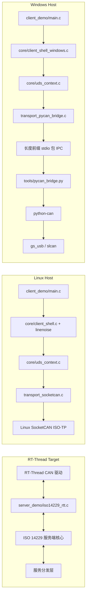

[English](README.md)

# RT-Thread UDS 服务端与客户端示例

这是一个面向 **RT-Thread UDS 服务端集成** 与 **主机侧 UDS 客户端执行** 的参考工程。

仓库的组织目标很明确：把 **UDS / ISO-TP 业务逻辑保留在 C 层**，把 **RT-Thread 服务端集成隔离在 `server_demo/`**，同时让不同主机平台使用最适合自身环境的传输路径。

## 文档导航

- [English README](README.md)
- [整体架构总览](docs/architecture.zh-CN.md)
- [API 参考](docs/api-reference.zh-CN.md)
- [Linux 编译与运行文档](docs/linux-build.zh-CN.md)
- [Windows 编译文档](docs/windows-build.zh-CN.md)
- [`PYCAN_BRIDGE` 的 Python / pip 工作流](docs/pycan-pip-workflow.zh-CN.md)
- [服务端模块说明](server_demo/README_ZN.md)

## 仓库结构

```text
.
├── README.md
├── README_ZN.md
├── docs/
│   ├── architecture.md
│   ├── architecture.zh-CN.md
│   ├── api-reference.md
│   ├── api-reference.zh-CN.md
│   ├── linux-build.md
│   ├── linux-build.zh-CN.md
│   ├── windows-build.md
│   ├── windows-build.zh-CN.md
│   ├── pycan-pip-workflow.md
│   └── pycan-pip-workflow.zh-CN.md
├── iso14229.c
├── iso14229.h
├── client_demo/
│   ├── CMakeLists.txt
│   ├── CMakePresets.json
│   ├── Makefile
│   ├── main.c
│   ├── core/
│   ├── platform/
│   ├── services/
│   ├── tools/
│   └── transport/
└── server_demo/                  # Git 子模块：RT-Thread 服务端代码树
    ├── Kconfig
    ├── SConscript
    ├── iso14229_rtt.c
    ├── iso14229_rtt.h
    ├── rtt_uds_config.h
    ├── README.md
    └── README_ZN.md
```

## `server_demo/` 子模块说明

`server_demo/` 按独立维护的 Git 子模块使用。在这个主仓库里应当**引用和说明它**，但不从 superproject 侧直接改写其内容。

首次克隆时，直接把子模块一起拉下来：

```bash
git clone --recurse-submodules <repo-url>
```

如果主仓库已经拉取过，再执行下面的初始化与更新：

```bash
git submodule update --init --recursive
```

如果上游调整过子模块 URL 或映射关系，先同步再更新：

```bash
git submodule sync --recursive
git submodule update --init --recursive
```

## 文档中的示例命令约定

除非某一节明确说明例外，本文档集里的运行示例统一使用下面这组诊断参数：

```bash
./client -i can1 -s 7D1 -t 7E1 -f 7E0
```

含义如下：

- `can1` 作为文档里的统一示例接口名
- `7D1` 作为 tester 物理源地址
- `7E1` 作为 ECU 物理目标地址
- `7E0` 作为功能寻址 ID

Windows 示例会先保留同样的 `-i/-s/-t/-f` 参数块，再追加 `pycan_bridge` 所需参数。

## 仓库中各部分的职责

### `server_demo/`

RT-Thread 侧服务端集成层：

- ISO 14229 协议栈的 RT-Thread 适配层
- 面向具体服务的 Kconfig 开关
- 基于 SConscript 的包集成方式
- RT-Thread 服务处理器的注册与分发模型

### `client_demo/`

主机侧客户端，分为两条平台路线：

- **Linux**：原生 SocketCAN + Linux ISO-TP socket
- **Windows**：MSYS2 构建的 C 客户端 + `python-can` sidecar bridge

Windows 目录中仍保留 **历史 `TSMASTER_API` smoke 路径**，但当前文档和 preset 已将 **`PYCAN_BRIDGE` 视为默认实现路径**。

## 架构快照



更详细的选型理由、运行链路、组件职责和平台差异，请继续阅读 [整体架构总览](docs/architecture.zh-CN.md)。

## 为什么这样拆分

### Linux

Linux 已经提供原生 SocketCAN 栈与 ISO-TP socket API，因此客户端可以完全保持在 C 层，并直接绑定宿主机 CAN 接口。

### Windows

仓库已经具备 Windows C 构建骨架，但原始 CAN 硬件访问更依赖具体适配器。因此项目当前采用：

- **MSYS2 MINGW64** 构建正式 C 客户端
- 使用 **Python sidecar** 通过 `python-can` 接入 CAN 适配器
- 仅为 SDK 绑定场景保留 **历史 TSMaster smoke 目标**

### 为什么同时有 `gs_usb` 和 `slcan`

当前 Python bridge 刻意只暴露两类接口：

- `gs_usb`：面向 USB CAN 适配器
- `slcan`：面向串口 / LAWICEL 风格适配器

这样可以先覆盖一条 USB 路线和一条串口兜底路线，而不会过早把 bridge 的适配面做得过宽。

## 构建矩阵

| 场景 | 入口 | 推荐阅读 |
| --- | --- | --- |
| RT-Thread 服务端集成 | `server_demo/` | [服务端模块说明](server_demo/README_ZN.md) |
| Linux 本机构建 | `client_demo/CMakeLists.txt` | [Linux 编译与运行文档](docs/linux-build.zh-CN.md) |
| Linux 兼容 Makefile 构建 | `client_demo/Makefile` | [Linux 编译与运行文档](docs/linux-build.zh-CN.md) |
| Linux 交叉构建 | `client_demo/toolchain.cmake` | [Linux 编译与运行文档](docs/linux-build.zh-CN.md) |
| Windows / MSYS2 构建 | `client_demo/CMakePresets.json` | [Windows 编译文档](docs/windows-build.zh-CN.md) |
| Windows Python 运行时 | `client_demo/tools/` | [pip 工作流文档](docs/pycan-pip-workflow.zh-CN.md) |
| 公共接口与 API 地图 | `docs/` | [API 参考](docs/api-reference.zh-CN.md) |

## 快速开始

### 1. 服务端集成

先看 [server_demo/README_ZN.md](server_demo/README_ZN.md)。

### 2. Linux 客户端路径

```bash
cd client_demo
mkdir -p build
cd build
cmake ..
cmake --build . -j
./client -i can1 -s 7D1 -t 7E1 -f 7E0
```

SocketCAN 与运行参数的完整说明请看 [docs/linux-build.zh-CN.md](docs/linux-build.zh-CN.md)。

### 3. Windows 客户端路径

```powershell
cd client_demo
cmake --preset windows-pycan-mingw64
cmake --build --preset build-client-pycan
cd ..
.\client_demo\build-mingw64\client.exe -i can1 -s 7D1 -t 7E1 -f 7E0 -b pycan_bridge --python .\.venv\Scripts\python.exe --bridge-script client_demo\tools\pycan_bridge.py --py-if gs_usb --py-channel 0 --bitrate 1000000
```

完整的 Windows 环境模型请阅读 [docs/windows-build.zh-CN.md](docs/windows-build.zh-CN.md) 与 [docs/pycan-pip-workflow.zh-CN.md](docs/pycan-pip-workflow.zh-CN.md)。

## 已覆盖的服务范围

当前代码树中已经包含以下 UDS 服务组的客户端或服务端实现入口：

- `0x10` 会话控制
- `0x11` ECU 复位
- `0x22 / 0x2E` 数据读取 / 数据写入
- `0x27` 安全访问
- `0x28` 通信控制
- `0x2A` 周期数据 / ULOG 适配路径
- `0x2F` 输入输出控制
- `0x31` 例程控制 / 远程控制台
- `0x34 / 0x36 / 0x37 / 0x38` 下载 / 传输 / 文件链路
- `0x3E` Tester Present 工作流

## 语言跳转

- [English README](README.md)
- [中文 README](README_ZN.md)
- [Architecture (English)](docs/architecture.md)
- [API (English)](docs/api-reference.md)
- [Linux Guide (English)](docs/linux-build.md)
- [Windows Guide (English)](docs/windows-build.md)
- [pip Workflow (English)](docs/pycan-pip-workflow.md)
