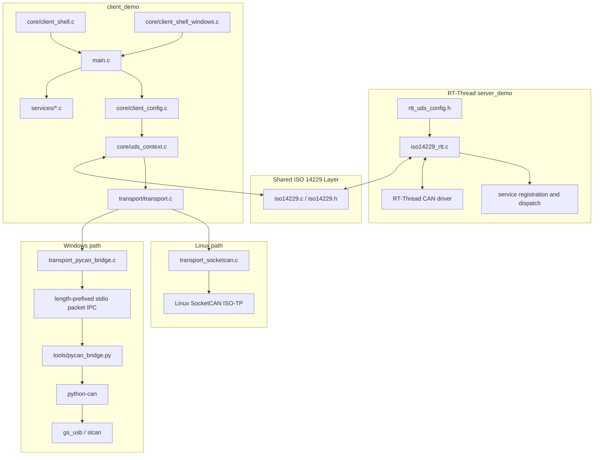
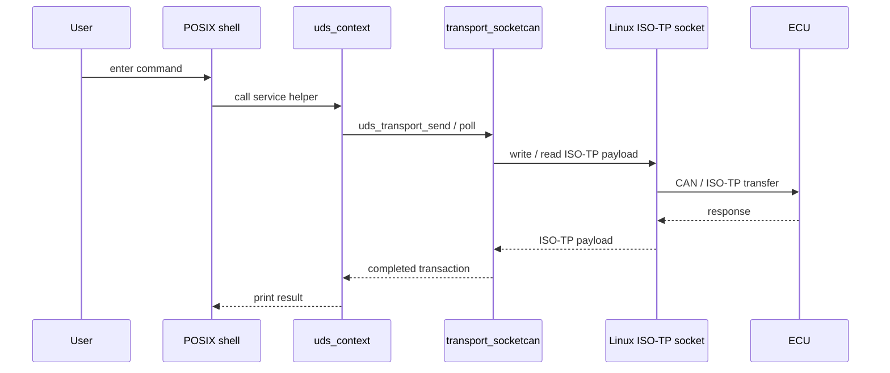
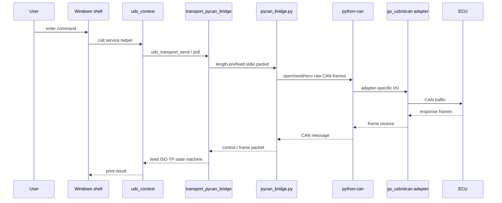
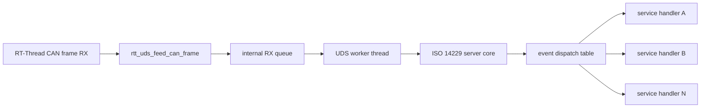

[中文](architecture.zh-CN.md) · [API Reference](api-reference.md) · [Back to README](../README.md)

# Architecture Overview

This document explains the **component split**, **runtime flow**, and **platform decisions** behind the repository.

## 1. Design goals

- Keep **UDS business logic** in the shared C codebase.
- Keep **RT-Thread server integration** isolated from host-side client logic.
- Use the **native Linux CAN path** on Linux.
- Use a **toolchain-friendly Windows build** without locking the formal client to one proprietary CAN SDK.
- Keep the transport boundary narrow so services and shell logic do not need to know which backend is active.

## 2. System architecture

## 3. Runtime flow

### 3.1 Common client lifecycle

### 3.2 Linux runtime path

### 3.3 Windows runtime path

## 4. Why Linux uses the repository POSIX shell

Linux builds compile `core/client_shell.c` together with `utils/linenoise.c`.

That is the right fit for the Linux path because:

- the repository already has a **POSIX-oriented interactive shell** with history, completion, prompt redraw, and async output coordination
- the Linux client remains a **single native C process**
- no second shell implementation is needed when the target terminal already behaves like a POSIX TTY

In short: Linux does not need a new terminal layer. The repository already had one that matches the execution model.

## 5. Why Linux uses the host ISO-TP socket path

The Linux CMake path explicitly checks for `linux/can/isotp.h` and builds `transport_socketcan.c` when `CMAKE_SYSTEM_NAME` is `Linux`. That choice is intentional:

- the Linux kernel already exposes **ISO-TP through the SocketCAN socket API**
- the application can send and receive **payloads**, while the kernel handles ISO-TP segmentation, flow control, and addressing state
- the Linux path therefore stays compact and close to the platform-native interface

## 6. Why Windows uses `PYCAN_BRIDGE` instead of `TSMASTER_API`

The repository still ships a `TSMASTER_API` path, but the current documentation treats it as a **legacy smoke path**. The reasons are architectural:

### `PYCAN_BRIDGE` advantages in this repository

- the formal client binary remains **plain C built by MSYS2 MINGW64**
- CAN adapter access is moved into a **replaceable Python sidecar**
- adapter choice is mediated by **`python-can`**, not by one fixed vendor SDK
- the transport boundary stays narrow: the C layer still owns **UDS + ISO-TP client state**, while Python handles **raw CAN I/O only**

### `TSMASTER_API` limitations in this repository

- the preset requires an explicit `UDS_TSMASTER_SDK_DIR`
- the CMake path searches for `TSMaster.h` and `TSMaster.lib`
- that makes the build and deployment model **SDK-layout dependent**

So the choice is not “Python is better than C”. The real choice is: **for Windows adapter access, `python-can` is less repository-coupled than one proprietary SDK layout**.

## 7. Why `python-can` currently exposes both `gs_usb` and `slcan`

The current bridge validates only two interfaces: `gs_usb` and `slcan`.

### `gs_usb`

Use it when the CAN adapter is a USB device supported by the `gs_usb` ecosystem.

Why it is kept:

- it covers common **candleLight / canable / cantact style USB adapters**
- it is a clean fit for **USB-direct Windows access** through `python-can`
- the repository requirements already include the packages needed by that path

### `slcan`

Use it when the adapter is exposed as a **serial / COM port** using the SLCAN / LAWICEL style protocol.

Why it is kept:

- it provides a practical **serial fallback path**
- it works naturally with **COM port naming** such as `COM4@9600`
- it avoids forcing every Windows user onto one USB-only adapter family

### Practical difference

| Interface | Typical hardware shape | Channel example | When to prefer |
| --- | --- | --- | --- |
| `gs_usb` | USB CAN dongle | `0` | native USB adapter supported by the `gs_usb` stack |
| `slcan` | Serial / USB-serial CAN adapter | `COM4@9600` | serial COM device or LAWICEL-compatible bridge |

## 8. Why the Windows documentation includes Python, MSYS2, and pip links

The Windows environment is intentionally split into two planes:

- **MSYS2 MINGW64** builds the C executable
- **Windows Python** creates the virtual environment and runs the sidecar

Because of that split, the documentation must point to:

1. **Python installation**: needed to create the virtual environment and run `pycan_bridge.py`
2. **MSYS2 installation**: needed to provide `gcc`, `cmake`, and `ninja` for the Windows C build
3. **pip installation / usage**: needed to install the Python-side dependencies in a reproducible way

Those links are not filler. They define the toolchain layers required by the repository’s Windows execution model.

## 9. Why Windows has a dedicated shell implementation

Linux uses `client_shell.c` plus `linenoise`, but Windows builds compile `core/client_shell_windows.c` and `platform/platform_windows.c`.

This is necessary because the Windows client needs to manage:

- console mode capture and restore
- `_kbhit()` / `_getch()` style polling
- VT capability detection and fallback redraw logic
- prompt rendering compatible with the Windows console model

That is a different I/O model from the POSIX + `linenoise` path. Reusing the Linux shell directly would make console behavior fragile on Windows.

## 10. Why Windows is usually slower than Linux in this repository

The point here is not that Windows changes the protocol semantics. The point is that **for the same UDS transaction flow, the current Windows path in this repository usually has a higher end-to-end software overhead**.

### The Linux path is shorter

The current Linux chain is:

`client.exe -> transport_socketcan.c -> Linux ISO-TP socket -> ECU`

Its characteristics are:

- the client stays a **single-process native C program**
- ISO-TP segmentation, flow control, and reassembly are handled by the **kernel SocketCAN ISO-TP stack**
- the application layer sends and receives **ISO-TP payloads** directly, without an extra bridge protocol

### The Windows path is longer

The current Windows chain is:

`client.exe -> transport_pycan_bridge.c -> child-process stdio packet IPC -> pycan_bridge.py -> python-can -> gs_usb/slcan -> ECU`

Its characteristics are:

- it involves at least **two executables: the C client and the Python sidecar**
- the bridge must do **packet framing plus metadata encoding/decoding** between C and Python
- frame traffic crosses **child-process pipes / stdio IPC**
- `python-can` then dispatches to the concrete adapter backend
- in `slcan` mode, the stack adds **serial ASCII protocol overhead** on top

### Where the extra latency comes from

In this repository, the most common extra costs on Windows are:

1. **an extra process boundary** between the C client and the Python bridge
2. **extra packet and metadata handling**, because the hot path frames messages into length-prefixed packets and still parses metadata on both sides
3. **extra scheduling and buffering**, including child-process pipes, stdio flushing, and thread scheduling
4. **user-space adapter access**, whereas Linux goes straight to the kernel ISO-TP socket path
5. **`slcan` protocol overhead**, because serial SLCAN transport is typically heavier than a native USB CAN path

### Conclusion

So the claim is not “Windows is inherently slower than Linux.” The accurate statement is:

> **In the current implementation of this repository, Linux uses the native kernel ISO-TP path, while Windows uses a C client plus a Python bridge plus an adapter backend. That usually gives Windows a higher software-stack overhead.**

If you want to reduce the gap on Windows, prefer:

- `gs_usb` over `slcan` when your hardware supports it
- local same-host bridge execution
- the Linux host path for latency-sensitive diagnostic work

## 11. Server-side architecture

The RT-Thread side is organized around an environment object, a CAN receive path, and a service-dispatch table.

Core ideas:

- RT-Thread receives CAN frames first
- the environment object queues and processes them in its own context
- event handlers are registered as service nodes and dispatched by priority / event type

## 12. Where to look next

- [API Reference](api-reference.md)
- [Linux Build and Run Guide](linux-build.md)
- [Windows Build Guide](windows-build.md)
- [Python / pip Workflow](pycan-pip-workflow.md)
- [Server Module Notes](../server_demo/README.md)
