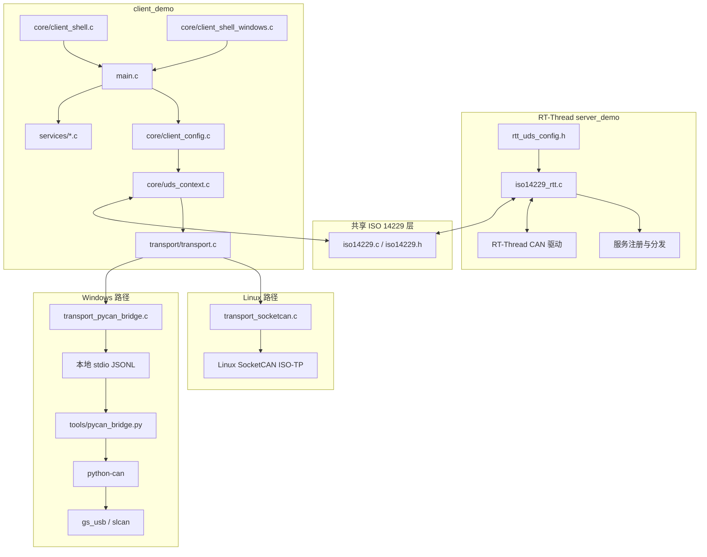
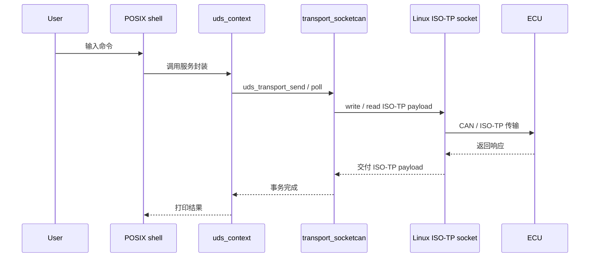
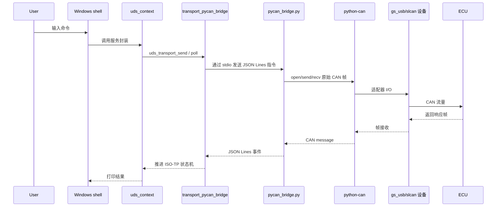
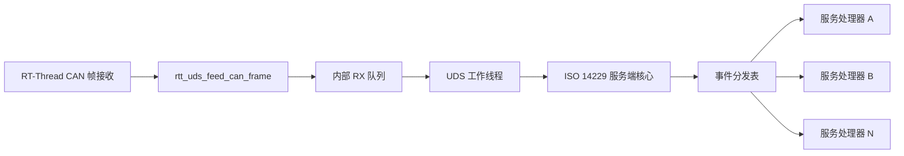

[English](architecture.md) · [API 参考](api-reference.zh-CN.md) · [返回 README](../README_ZN.md)

# 整体架构总览

本文档解释仓库的 **组件拆分方式**、**运行流程** 与 **平台选型理由**。

## 1. 设计目标

- 让 **UDS 业务逻辑** 保持在共享 C 代码层。
- 让 **RT-Thread 服务端集成** 与主机侧客户端解耦。
- 在 Linux 上走 **原生 CAN 路径**。
- 在 Windows 上提供 **可维护的构建方式**，而不是把正式客户端锁死到单一私有 SDK。
- 把 transport 边界做窄，这样服务层和 shell 层无需关心底层究竟使用哪个后端。

## 2. 系统架构

## 3. 运行流程

### 3.1 客户端公共生命周期

### 3.2 Linux 运行链路

### 3.3 Windows 运行链路

## 4. 为什么 Linux 直接用仓库里的终端实现

Linux 构建会编译 `core/client_shell.c` 与 `utils/linenoise.c`。

这样做是合理的，因为：

- 仓库里已经存在一个 **面向 POSIX TTY 的交互 shell**，自带历史、补全、提示符重绘与异步输出协调
- Linux 客户端保持为 **单进程原生 C 程序** 即可
- 当目标终端本身已经符合 POSIX 模型时，没有必要再引入第二套 shell 实现

也就是说：Linux 不需要再写一层新终端，仓库里原有的实现已经匹配执行模型。

## 5. 为什么 Linux 走宿主机 ISO-TP socket

Linux 的 CMake 路径会显式检查 `linux/can/isotp.h`，并在 `CMAKE_SYSTEM_NAME=Linux` 时编译 `transport_socketcan.c`。这个选择是有意为之：

- Linux 内核已经通过 SocketCAN 暴露 **ISO-TP socket API**
- 应用层只需要发送和接收 **payload**，而不必自己重复实现分片、流控和地址状态管理
- 因此 Linux 路径可以保持简洁，并且直接贴合平台原生接口

## 6. 为什么 Windows 选 `PYCAN_BRIDGE` 而不是 `TSMASTER_API`

仓库里仍然保留 `TSMASTER_API` 路径，但当前文档把它定义为 **历史 smoke 路径**。原因主要是架构层面的。

### `PYCAN_BRIDGE` 的优点

- 正式客户端二进制仍然是 **MSYS2 MINGW64 构建的纯 C 程序**
- CAN 适配器访问被放到 **可替换的 Python sidecar** 中
- 适配器接入通过 **`python-can`** 统一，而不是直接绑定一个固定 SDK
- transport 边界保持很窄：C 层继续持有 **UDS + ISO-TP client 状态**，Python 只负责 **原始 CAN I/O**

### `TSMASTER_API` 在当前仓库中的限制

- preset 需要显式提供 `UDS_TSMASTER_SDK_DIR`
- CMake 会去查找 `TSMaster.h` 与 `TSMaster.lib`
- 这意味着构建与部署模型会 **绑定特定 SDK 的目录布局**

所以这里并不是“Python 比 C 更好”，而是：**在 Windows 适配器接入层，`python-can` 比单一私有 SDK 更不容易把仓库结构锁死。**

## 7. 为什么 `python-can` 里同时保留 `gs_usb` 与 `slcan`

当前 bridge 只允许两个接口：`gs_usb` 与 `slcan`。

### `gs_usb`

适用于被 `gs_usb` 生态支持的 USB CAN 适配器。

保留它的原因：

- 覆盖常见的 **candleLight / canable / cantact 类 USB 适配器**
- 很适合 **Windows 下的 USB 直连访问**
- 仓库的 requirements 已经把该路径需要的依赖列清楚了

### `slcan`

适用于通过 **串口 / COM 口** 暴露的 SLCAN / LAWICEL 风格适配器。

保留它的原因：

- 提供一条实用的 **串口兜底路径**
- 与 **`COM4@9600`** 这种 Windows 串口表达天然匹配
- 避免所有 Windows 用户都被迫绑定到 USB-only 设备族

### 实际差异

| 接口 | 常见硬件形态 | Channel 示例 | 适用场景 |
| --- | --- | --- | --- |
| `gs_usb` | USB CAN 适配器 | `0` | 设备已被 `gs_usb` 栈支持 |
| `slcan` | 串口 / USB 转串口 CAN 适配器 | `COM4@9600` | 设备以串口协议暴露 |

## 8. 为什么 Windows 文档里必须给出 Python、MSYS2 与 pip 链接

Windows 环境被刻意拆成两层：

- **MSYS2 MINGW64** 负责构建 C 可执行文件
- **Windows Python** 负责创建虚拟环境并运行 sidecar

因此文档必须给出：

1. **Python 安装链接**：因为要创建虚拟环境并运行 `pycan_bridge.py`
2. **MSYS2 安装链接**：因为要提供 `gcc`、`cmake`、`ninja`
3. **pip 安装 / 使用链接**：因为要以可复现方式安装 Python 侧依赖

这些链接不是装饰，而是当前 Windows 执行模型的工具链组成部分。

## 9. 为什么 Windows 要自己重写终端实现

Linux 使用的是 `client_shell.c` + `linenoise`，而 Windows 构建会编译 `core/client_shell_windows.c` 与 `platform/platform_windows.c`。

这是必要的，因为 Windows 客户端需要处理：

- console mode 的保存与恢复
- `_kbhit()` / `_getch()` 风格的输入轮询
- VT 能力检测与降级重绘逻辑
- 与 Windows console 模型兼容的提示符显示

这和 POSIX + `linenoise` 的 I/O 模型并不相同。直接复用 Linux shell，会让 Windows console 行为变得脆弱。

## 10. 为什么 Windows 一般会比 Linux 更慢

这里说的“更慢”，不是指协议语义变了，而是指 **同一组 UDS 交互在当前仓库实现里，Windows 路径通常会有更高的端到端软件开销**。

### Linux 路径更短

Linux 当前链路是：

`client.exe -> transport_socketcan.c -> Linux ISO-TP socket -> ECU`

它的特点是：

- 客户端保持为 **单进程原生 C 程序**
- ISO-TP 分段、流控与重组交给 **内核 SocketCAN ISO-TP**
- 应用层直接收发 **ISO-TP payload**，中间不需要额外桥接协议

### Windows 路径更长

Windows 当前链路是：

`client.exe -> transport_pycan_bridge.c -> 子进程 stdio JSON Lines -> pycan_bridge.py -> python-can -> gs_usb/slcan -> ECU`

它的特点是：

- 至少包含 **C 进程 + Python sidecar 两个执行体**
- C 与 Python 之间要做 **JSON Lines 编码 / 解码**
- 帧收发要经过 **子进程管道 / stdio IPC**
- `python-can` 再继续调用具体适配器后端
- `slcan` 场景下还会再叠加 **串口 ASCII 协议** 开销

### 因此慢在哪里

在本仓库实现里，Windows 侧常见的额外开销主要来自：

1. **额外的进程边界**：一次事务要跨过 C 进程与 Python 进程
2. **额外的数据封装**：CAN 帧在桥接层被序列化成 JSON Lines 文本，再由另一侧反序列化
3. **额外的调度与缓冲**：子进程管道、stdio 刷新和线程调度都会引入额外延迟
4. **用户态适配器访问**：Linux 直接走内核 ISO-TP socket；Windows 当前默认路径要先落到 `python-can` 适配层
5. **`slcan` 的协议特性**：如果设备走串口 SLCAN，ASCII 命令/响应链路通常比原生 USB CAN 路径更重

### 结论

所以这里不是“Windows 天生比 Linux 慢”，而是：

> **在这个仓库当前的实现里，Linux 走原生内核 ISO-TP，Windows 走 C + Python bridge + 适配器后端，因此 Windows 路径通常会有更高的软件栈开销。**

如果你在 Windows 上希望尽量缩小差距，优先建议：

- 优先使用 `gs_usb`，避免 `slcan` 的串口 ASCII 开销
- 保持 bridge 与 client 在同机本地运行
- 只在确实需要 Windows 平台时走 `PYCAN_BRIDGE`

## 11. 服务端架构

RT-Thread 侧围绕环境对象、CAN 接收路径与服务分发表展开。

关键点：

- RT-Thread 先接收 CAN 帧
- 环境对象把帧放进自己的处理上下文
- 事件处理器以 service node 的形式注册，再按事件类型和优先级分发

## 12. 下一步阅读

- [API 参考](api-reference.zh-CN.md)
- [Linux 编译与运行文档](linux-build.zh-CN.md)
- [Windows 编译文档](windows-build.zh-CN.md)
- [Python / pip 工作流](pycan-pip-workflow.zh-CN.md)
- [服务端模块说明](../server_demo/README_ZN.md)
